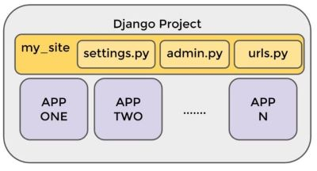
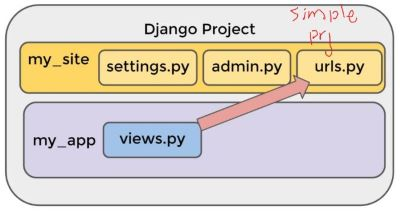
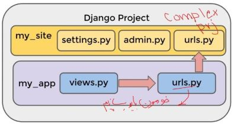

# 	Install

- Download and install VSCode and Python

```bash
pip install django
```


# Architecture
- Django projects
  


- Simple projects



- Complex projects




# Function-based view

```bash
django-admin startproject my_site    # Create project
python .\manage.py startapp my_app   # Create app directory
python .\manage.py runserver 9999    # Run on port 9999
```

- ```my_site``` > ```my_app``` > ```views.py```

```python
from django.shortcuts import render
from django.http import HttpResponse

# Create your views here.
def index(request):
    return HttpResponse("Hello World")
```

- ```my_site``` > ```my_app``` > ```urls.py```

```python
from django.urls import path
from . import views   # . is current folder

urlpatterns = [
    path('simple_view', views.index, name='index')
]
```

- ```my_site``` > ```my_site``` > ```urls.py```

```python
from django.contrib import admin
from django.urls import path, include
from . import views

urlpatterns = [
    path('admin/', admin.site.urls),
    path('my_app/', include('my_app.urls')),
    path('', views.home_view, name='home')
]
```

- ```my_site``` > ```my_site``` > ```views.py```

```bash
from django.http import HttpResponse

def home_view(request):
    return HttpResponse("Home Page")
```

- Run
  - Home page  =>  http://127.0.0.1:8000/
  - my_app  =>  http://127.0.0.1:8000/my_app/simple_view

```bash
python .\manage.py runserver
```

# Using Template

- In this example, templates are in projects level that is not good
- ```my_site``` > ```templates``` > ```my_app``` > ```example.html```

```html
<!DOCTYPE html>
<html>
    <head>
        <meta charset="UTF-8">
        <title>EXAMPLE</title>
        <link href="https://cdn.jsdelivr.net/npm/bootstrap@5.3.0-alpha1/dist/css/bootstrap.min.css" rel="stylesheet" integrity="sha384-GLhlTQ8iRABdZLl6O3oVMWSktQOp6b7In1Zl3/Jr59b6EGGoI1aFkw7cmDA6j6gD" crossorigin="anonymous">
        <script src="https://cdn.jsdelivr.net/npm/bootstrap@5.3.0-alpha1/dist/js/bootstrap.bundle.min.js" integrity="sha384-w76AqPfDkMBDXo30jS1Sgez6pr3x5MlQ1ZAGC+nuZB+EYdgRZgiwxhTBTkF7CXvN" crossorigin="anonymous"></script>
    </head>

    <body>
        <!-- https://getbootstrap.com/docs/5.3/components/accordion/ -->       
    </body>
</html>
```

- ```my_site``` > ```my_app``` > ```views.py```

```python
from django.shortcuts import render

# Create your views here.
def simple_view(request):
    return render(request, 'my_app/example.html')
```

- ```my_site``` > ```my_app``` > ```urls.py```

```python
from django.urls import path
from . import views

urlpatterns = [
    path('', views.simple_view, name='index')   # 
]
```

- Run
  - http://127.0.0.1:8000/my_app/


# Complete Project

- Template with variable, Filter, Tag, Inheritance, Custom Error, Static Files
- First create project and app
- ```my_site``` > ```my_app``` > ```views.py``` 

```python
from django.shortcuts import render

# Create your views here.
def landing_view(request):
    return render(request, 'my_app/landing.html')

def variable_view(request):
    my_var = {'first_name': 'Ehsan', 'last_name': 'Ebadi',
              'user_logged_in': True,
              'some_list': [1,2,3],
              'some_dict': {'inside_key': 'insode_value'}
    }
    return render(request, 'my_app/variable.html', context=my_var)  # my_app>templates>"my_app"
```

- ```my_site``` > ```my_app``` > ```urls.py``` 

```python
from django.urls import path
from . import views

app_name = 'my_app'

urlpatterns = [
    path('', views.landing_view, name='landing'),
    path('variable/', views.variable_view, name='variable')
]
```

- ```my_site``` > ```my_site``` > ```urls.py``` 

```python
from django.contrib import admin
from django.urls import path, include
from . import views

urlpatterns = [
    path('admin/', admin.site.urls),
    path('my_app/', include('my_app.urls')),
    path('', views.home_view, name='home')
]
```

- ```my_site``` > ```my_app``` > ```apps.py``` 

```python
from django.apps import AppConfig    # created automatically

class MyAppConfig(AppConfig):
    default_auto_field = 'django.db.models.BigAutoField'
    name = 'my_app'
```

- ```my_site``` > ```my_site``` > ```urls.py``` 

```python
import os

# Application definition

INSTALLED_APPS = [
    'my_app.apps.MyAppConfig',        # important, names come from apps.py
    'django.contrib.admin',
    'django.contrib.auth',
    'django.contrib.contenttypes',
    'django.contrib.sessions',
    'django.contrib.messages',
    'django.contrib.staticfiles',     # important
]
    
TEMPLATES = [
    {
        'BACKEND': 'django.template.backends.django.DjangoTemplates',
        'DIRS': [os.path.join(BASE_DIR, 'templates')],
        'APP_DIRS': True,
        
STATIC_URL = 'static/'
```

- Migrate

```bash
python.exe .\manage.py migrate  # look at INSTALLED_APPS and creates any necessary databse tables
python.exe .\manage.py makemigrations my_app  # Register app and databse
python.exe .\manage.py migrate   # Create the model tables in databse
```

- ```my_site``` > ```my_app``` > ```templates``` > ```my_app``` > ```landing.html```

```html




    <a href=>Click to got variable page</a>
    

```

- ```my_site``` > ```my_app``` > ```templates``` > ```my_app``` > ```variable.html```
  - Install *Django* extension to look beautiful
  - tags and filters  =>  https://docs.djangoproject.com/en/4.0/ref/templates/builtins

```html



    <h3>My name is {{first_name | lower | capfirst}} {{last_name}}</h3>
    <h3>{{some_list.1}}</h3>
    <h3>{{some_dict.inside_key}}</h3>

    <ul>
        
            <li>{{item}}</li>
        
    </ul>

    <ul>
        
            <li>{{k}}</li>
        
    </ul>

    
        <h3>Welcome Friend</h3>
         
        
    
        <h3>Hello EHSAN</h3>
      

```

- ```my_site``` > ```templates``` > ```base.html```

```html
<!DOCTYPE html>
<html>
    <head>
        <meta charset="UTF-8">
        <title>EXAMPLE</title>
        <link href="https://cdn.jsdelivr.net/npm/bootstrap@5.3.0-alpha1/dist/css/bootstrap.min.css" rel="stylesheet" integrity="sha384-GLhlTQ8iRABdZLl6O3oVMWSktQOp6b7In1Zl3/Jr59b6EGGoI1aFkw7cmDA6j6gD" crossorigin="anonymous">
        <script src="https://cdn.jsdelivr.net/npm/bootstrap@5.3.0-alpha1/dist/js/bootstrap.bundle.min.js" integrity="sha384-w76AqPfDkMBDXo30jS1Sgez6pr3x5MlQ1ZAGC+nuZB+EYdgRZgiwxhTBTkF7CXvN" crossorigin="anonymous"></script>
    </head>

    <body>
        <h1>HEADER</h1>
        
        
        <h1>FOOTER</h1>
    </body>
</html>
```

- ```my_site``` > ```templates``` > ```404.html```

```html
<!DOCTYPE html>
<html>
    <head>
        <meta charset="UTF-8">
        <title>EXAMPLE</title>
        <link href="https://cdn.jsdelivr.net/npm/bootstrap@5.3.0-alpha1/dist/css/bootstrap.min.css" rel="stylesheet" integrity="sha384-GLhlTQ8iRABdZLl6O3oVMWSktQOp6b7In1Zl3/Jr59b6EGGoI1aFkw7cmDA6j6gD" crossorigin="anonymous">
        <script src="https://cdn.jsdelivr.net/npm/bootstrap@5.3.0-alpha1/dist/js/bootstrap.bundle.min.js" integrity="sha384-w76AqPfDkMBDXo30jS1Sgez6pr3x5MlQ1ZAGC+nuZB+EYdgRZgiwxhTBTkF7CXvN" crossorigin="anonymous"></script>
    </head>

    <body>
        <h1>CUSTOM 404 PAGE</h1>
    </body>
</html>
```

- ```settings.py```
  - Show custom 404 error page
    - ```DEBUG = False```
    - ```ALLOWED_HOSTS = ["127.0.0.1"]```
  - Show static image
    - ```DEBUG = True```
    - ```ALLOWED_HOSTS  = []```

- ```my_site``` > ```my_app``` > ```static``` > ```my_app``` 
  - Place an image here


# Model

- Create a new project and app

```powershell
PS C:\test2> django-admin startproject my_site
PS C:\test2> cd .\my_site\
PS C:\test2\my_site> python .\manage.py startapp office
```

- ```my_site``` > ```my_site``` > ```settings.py```
  - Register a database in settings

```python
DATABASES = {
    'default': {
        'ENGINE': 'django.db.backends.sqlite3',
        'NAME': BASE_DIR / 'db.sqlite3',
    }
}
```

- Create the database

```bash
python.exe .\manage.py migrate
```

- ```my_site``` > ```office``` > ```models.py```
  - Create model with fields

```python
from django.db import models
from django.core.validators import MaxValueValidator, MinValueValidator

# Create your models here.
class Patient(models.Model):
    first_name = models.CharField(max_length=30)
    last_name = models.CharField(max_length=30)
    age = models.IntegerField(validators=[MinValueValidator(0), MaxValueValidator(120)])
    heartrate = models.IntegerField(default=60, validators=[MinValueValidator(1), MaxValueValidator(300)])  # default is neede when adding new column to existing table
    # artist = models.ForeignKEy(Musician, on_delete=models.CASCADE)

    def __str__(self):
        return f"{self.first_name} {self.last_name} is {self.age} years old."
```

- ```my_site``` > ```office``` > ```apps.py```

```python
from django.apps import AppConfig

class OfficeConfig(AppConfig):
    default_auto_field = 'django.db.models.BigAutoField'
    name = 'office'
```

- ```my_site``` > ```my_site``` > ```settings.py```
  - Register app

```python
# Application definition

INSTALLED_APPS = [
    'office.apps.OfficeConfig',
```

- Migration
  - Connecting changes (add new model, add new app, update model with a new column/attribute) in project/app to the database
  - ```makemigrations``` Create set of SQL instructions in ```app``` > ```migrations``` > ```0001_initial.py```
  - ```migrate``` Run any existing migration created by ```makemigrations```

```powershell
python.exe .\manage.py makemigrations office
python.exe .\manage.py migrate
```

- ```my_site``` > ```my_site``` > ```urls.py```

```python
from django.contrib import admin
from django.urls import path, include

urlpatterns = [
    path('admin/', admin.site.urls),
    path('office/', include('office.urls'))
]
```

- ```my_site``` > ```office``` > ```urls.py```

```python
from django.urls import path
from . import views

urlpatterns = [
    path('', views.list_patients, name='list_patients')
]
```

- ```my_site``` > ```office``` > ```views.py```

```python
from django.shortcuts import render
from . import models

# Create your views here.
def list_patients(request):
    all_patients = models.Patient.objects.all()
    context = {'patients':all_patients}
    return render(request, 'office/list.html', context=context)
```

- Other queries
  - https://docs.djangoproject.com/en/4.0/topics/db/queries/
  - https://docs.djangoproject.com/en/4.0/ref/models/querysets/#field-lookups


```python
Patient.objects.get(pk=1)
Patient.objects.get(first_name='smith')
Patient.objects.filter(last_name='smith').all()
Patient.objects.filter(last_name='smith').filter(age=40).all()
```
```python
Patient.objects.fitler(last_name__startwith='s').all()  # QuerySet
Patient.objects.fitler(age__in=[20,30,40]).all()
Patient.objects.fitler(age__gte=39).all()
```
```python
from django.db.models import Q
Patient.objects.fitler(Q(last_name='smith') & Q(age=40)).all()
Patient.objects.fitler(Q(last_name='smith') | Q(age=40)).all()
```
```python
Patient.objects.order_by('age').all()   # order by
```

- ```my_site``` > ```office``` > ```templates``` > ```office``` > ```list.html```

```html
<html>
    <body>
        <ul>
            
                <li>{{person}}</li>
            
        </ul>
    </body>
</html>
```

- Insert data 

```powershell
python.exe .\manage.py shell
>>> from office.models import Patient 

# Method 1: Create object and .save()
>>> ehsan = Patient(first_name='ehsan',last_name='ebadi', age=37, heartrate=80)
>>> ehsan.save()

# Method 2: objects.create()
>>> Patient.objects.create(first_name='susan',last_name='smith',age=40)

# Method 3: objects.bulk_create()
>>> mylist=[Patient(first_name='adam',last_name='smith',age=20),Patient(first_name='karl',last_name='marx',age=30)]
>>> Patient.objects.bulk_create(mylist)
```

- Run

```powershell
python.exe .\manage.py runserver
```


# Admin

- Create project

```powershell
PS C:\test3> django-admin startproject my_car_site 
PS C:\test3> cd .\my_car_site\
PS C:\test3\my_car_site> python.exe .\manage.py startapp cars
```

- ```my_car_site``` > ```templates``` > ```base.html```

```html
<!DOCTYPE html>
<html>
    <head>
        <meta charset="UTF-8">
        <title>CAR</title>
        <link href="https://cdn.jsdelivr.net/npm/bootstrap@5.3.0-alpha1/dist/css/bootstrap.min.css" rel="stylesheet" integrity="sha384-GLhlTQ8iRABdZLl6O3oVMWSktQOp6b7In1Zl3/Jr59b6EGGoI1aFkw7cmDA6j6gD" crossorigin="anonymous">
        <script src="https://cdn.jsdelivr.net/npm/bootstrap@5.3.0-alpha1/dist/js/bootstrap.bundle.min.js" integrity="sha384-w76AqPfDkMBDXo30jS1Sgez6pr3x5MlQ1ZAGC+nuZB+EYdgRZgiwxhTBTkF7CXvN" crossorigin="anonymous"></script>
    </head>

    <body>
        <nav class="navbar navbar-expand-lg bg-light">
            <div class="container-fluid">
              <button class="navbar-toggler" type="button" data-bs-toggle="collapse" data-bs-target="#navbarSupportedContent" aria-controls="navbarSupportedContent" aria-expanded="false" aria-label="Toggle navigation">
                <span class="navbar-toggler-icon"></span>
              </button>
              <div class="collapse navbar-collapse" id="navbarSupportedContent">
                <div class="navbar-nav">
                    <a class="nav-link" href="" >LIST</a>
                    <a class="nav-link" href="" >ADD</a>
                    <a class="nav-link" href="" >DELETE</a>
                </div>
              </div>
            </div>
          </nav>

          
          
          

    </body>
</html>
```

- ```my_car_site``` > ```cars``` > ```templates``` > ```cars``` > ```add.html```

```python



    <div class=container>
        <h1>ADD</h1>

        <form action="" method='POST'>
            
            <div class="form-group">
                <label for="brand">Brand: </label>
                <input class="form-control" type="text" id="brand" name="brand">
            </div>
            <div class="form-group">
                <label for="year">Year: </label>
                <input class="form-control" type="text" id="year" name="year">
            </div>
            <input class="btn btn-primary" type="submit">
        </form>
    </div>

```

- ```my_car_site``` > ```cars``` > ```templates``` > ```cars``` > ```delete.html```
```python



    <div>
        <h1>DELETE</h1>

        <form action="" method='POST'>
            
            <div class="form-group">
                <label for="pk">PK number: </label>
                <input class="form-control" type="text" id="pk" name="pk" />
            </div>
            <input class="btn btn-primary" type="submit">
        </form>
    </div>

```


- ```my_car_site``` > ```cars``` > ```templates``` > ```cars``` > ```list.html```
```python



    <div>
        <h1>LIST</h1>

        <ul>
            
                <li>{{car}}</li>
            
        </ul>
    </div>

```


- ```my_car_site``` > ```cars``` > ```views.py```
```python
from django.shortcuts import render, redirect
from django.urls import reverse
from . import models

# Create your views here.
def list(request):
    all_cars = models.Car.objects.all()
    context = {'all_cars':all_cars}
    return render (request, 'cars/list.html', context=context)

def add(request):
    if request.POST:
        brand = request.POST['brand']
        year = int(request.POST['year'])
        models.Car.objects.create(brand=brand, year=year)
        return redirect(reverse('cars:list'))
    else:
        return render (request, 'cars/add.html')

def delete(request):
    if request.POST:
        pk = request.POST['pk']
        try:
            models.Car.objects.get(pk=pk).delete()
            return redirect(reverse('cars:list'))
        except:
            print ('not found')
            return redirect(reverse('cars:list'))
    else:
        return render (request, 'cars/delete.html')
```


- ```my_car_site``` > ```cars``` > ```urls.py```
```python
from django.urls import path
from . import views

app_name = 'cars'

urlpatterns = [
    path('list/', views.list, name='list'),
    path('add/', views.add, name='add'),
    path('delete/', views.delete, name='delete')
]
```


- ```my_car_site``` > ```my_car_site``` > ```urls.py```
```python
from django.contrib import admin
from django.urls import path, include

urlpatterns = [
    path('admin/', admin.site.urls),
    path('cars/', include('cars.urls'))
]
```


- ```my_car_site``` > ```cars``` > ```apps.py```
```python
from django.apps import AppConfig

class CarsConfig(AppConfig):
    default_auto_field = 'django.db.models.BigAutoField'
    name = 'cars'
```


- ```my_car_site``` > ```my_car_site``` > ```settings.py```
```python
import os

# Application definition

INSTALLED_APPS = [
    'cars.apps.CarsConfig',
    
TEMPLATES = [
    {
        'BACKEND': 'django.template.backends.django.DjangoTemplates',
        'DIRS': [os.path.join(BASE_DIR, 'templates')],
        'APP_DIRS': True,
```


- ```my_car_site``` > ```cars``` > ```models.py```
```python
from django.db import models

# Create your models here.
class Car(models.Model):
    brand = models.CharField(max_length=30)
    year = models.IntegerField()

    def __str__(self):
        return f"Car is {self.brand} {self.year}"
```


- Migration

```powershell
python.exe .\manage.py makemigrations cars
python.exe .\manage.py migrate
```

- Run  =>  http://127.0.0.1:8000/cars/list/

```powershell
python.exe .\manage.py runserver
```

- Create user

```powershell
python.exe .\manage.py createsuperuser
```

- ```my_car_site``` > ```cars``` > ```admin.py```
  - Register models to the admin interface

```python
from django.contrib import admin
from cars.models import Car

# Register your models here.
admin.site.register(Car)
```

- Check  =>  http://127.0.0.1:8000/admin/
- ```my_car_site``` > ```cars``` > ```admin.py```
  - Register model with *ModelAdmin* objects (in this way we can modify administration form, like change order)

```powershell
from django.contrib import admin
from cars.models import Car

class CarAdmin(admin.ModelAdmin):
    fields = ['year', 'brand']

# Register your models here.
admin.site.register(Car, CarAdmin)
```


# Form

- Create new project and app

```powershell
PS C:\test4> django-admin startproject mysite
PS C:\test4> cd .\mysite\
PS C:\test4\mysite> python.exe .\manage.py startapp cars
```

- ```mysite``` > ```cars``` > ```templates``` > ```cars``` > ```rental_review.html```

```python


<html>
    <head>
        <link href="https://cdn.jsdelivr.net/npm/bootstrap@5.2.0/dist/css/bootstrap.min.css" rel="stylesheet" integrity="sha384-gH2yIJqKdNHPEq0n4Mqa/HGKIhSkIHeL5AyhkYV8i59U5AR6csBvApHHNl/vI1Bx" crossorigin="anonymous">
        <script src="https://cdn.jsdelivr.net/npm/bootstrap@5.2.0/dist/js/bootstrap.bundle.min.js" integrity="sha384-A3rJD856KowSb7dwlZdYEkO39Gagi7vIsF0jrRAoQmDKKtQBHUuLZ9AsSv4jD4Xa" crossorigin="anonymous"></script>
        <link rel="stylesheet" href="">
    </head>
    <body>
        <h1>RENTAL_REVIEW</h1>

        <div class='container myform'>
            <form method="POST">
                
    
                
                    <div class='mb3'>
                        {{field.label_tag}}
                    </div>
                    {{field}}
                	{{field.errors}}
                
    
                <input type="submit">
            </form>
        </div>
    </body>
</html> 
```

- ```mysite``` > ```cars``` > ```templates``` > ```cars``` > ```thank_you.html```

```python
<html>
    <body>
        <h1>THANK_YOU</h1>
    </body>
</html>
```

- ```mysite``` > ```cars``` > ```views.py```

```python
from django.shortcuts import render, redirect
from django.urls import reverse
from .forms import ReviewForm

# Create your views here.
def rental_review(request):
    if request.method == 'POST':
        form = ReviewForm(request.POST)

        if form.is_valid():
            form.save()
            return redirect(reverse('cars:thank_you'))
    else:
        form = ReviewForm()

    return render(request, 'cars/rental_review.html', context={'form':form})

def thank_you(request):
    return render(request, 'cars/thank_you.html')
```

- ```mysite``` > ```cars``` > ```urls.py```

```python
from django.urls import path
from . import views

app_name = 'cars'

urlpatterns = [
    path('rental_review/', views.rental_review, name="rental_review"),
    path('thank_you/', views.thank_you, name="thank_you")
]
```

- ```mysite``` > ```mysite``` > ```urls.py```

```python
from django.contrib import admin
from django.urls import path, include

urlpatterns = [
    path('admin/', admin.site.urls),
    path('cars/', include('cars.urls'))
]
```

- ```mysite``` > ```cars``` > ```apps.py```

```python
from django.apps import AppConfig

class CarsConfig(AppConfig):
    default_auto_field = 'django.db.models.BigAutoField'
    name = 'cars'
```

- ```mysite``` > ```mysite``` > ```settings.py```

```python
# Application definition

INSTALLED_APPS = [
    
    'cars.apps.CarsConfig',
    'django.contrib.admin',
```

- ```mysite``` > ```cars``` > ```forms.py```

```python
from dataclasses import fields
from .models import Review
from django.forms import ModelForm

class ReviewForm(ModelForm):
    class Meta:
        model = Review
        fields = "__all__"

        labels = {
            'first_name':"YOUR FIRST NAME",
            'last_name':"LAST NAME",
            'stars': "RATING"
        }

        error_messages = {
            'stars':{
                'min_value':"YO! Min value is one",
                'max_value':"YO YO !!! MAX value is 5"
            }
        }
```

- ```mysite``` > ```cars``` > ```static``` > ```cars``` > ```custom.css```

```css
.myform{
    border: 5px dashed red;
}
```

- ```mysite``` > ```mysite``` > ```settings.py```

```python
# Static files (CSS, JavaScript, Images)
# https://docs.djangoproject.com/en/4.0/howto/static-files/

STATIC_URL = 'static/'
```

- ```mysite``` > ```cars``` > ```admin.py```

```python
from django.contrib import admin
from .models import Review

# Register your models here.
admin.site.register(Review)
```

- Migrate and Run  =>  http://127.0.0.1:8000/cars/rental_review/

```powershell
python.exe .\manage.py makemigrations cars
python.exe .\manage.py migrate
python.exe .\manage.py createsuperuser
python.exe .\manage.py runserver
```


# Class-based View

- Create new project and app

```powershell
PS C:\test4> django-admin startproject school
PS C:\test4> cd .\library\
PS C:\test4\mysite> python.exe .\manage.py startapp classroom
```

- ```school``` > ```classroom``` > ```templates``` > ```classroom``` > ```contact.html```
```html
<h1>Form View Template (contact.html)</h1>

<Form method="POST">
    
    {{form.as_p}}
    <input type="submit" value="submit">
</form>
```

- ```school``` > ```classroom``` > ```templates``` > ```classroom``` > ```home.html```
```html
<h1>Welcom to HOME !</h1>

<ul>
    <li>
        <a href="">THANK YOU PAGE LINK</a>
    </li>

    <li>
        <a href="">CONTACT FORM PAGE LINK</a>
    </li>

    <li>
        <a href="">CREATE TEACHER PAGE LINK</a>
    </li>

    <li>
        <a href="">LIST TEACHER PAGE LINK</a>
    </li>
</ul>
```
- ```school``` > ```classroom``` > ```templates``` > ```classroom``` > ```teacher_confirm_delete.html```
```html
<h1>Are you sure to delete ... </h1>
<h2>{{teacher}}</h2>

<form method="POST">
    
    <input type="submit" value="Confirm Delete" />
</form>
```
- ```school``` > ```classroom``` > ```templates``` > ```classroom``` > ```teacher_detail.html```
```html
<h1>Detail view for a teacher</h1>

{{teacher}}
```
- ```school``` > ```classroom``` > ```templates``` > ```classroom``` > ```teacher_form.html```
```html
<h1>Teacher Form</h1>

<form method="POST">
    
    {{form.as_p}}
    <input type="submit" value="Submit">
</form>
```
- ```school``` > ```classroom``` > ```templates``` > ```classroom``` > ```teacher_list.html```
```html
<h1>List of Theachers (ListView)</h1>

<ul>
    
        <li>
            <a href="/classroom/teacher_detail/{{teacher.id}}">{{teacher.first_name}} {{teacher.last_name}}</a>
            <a href="/classroom/update_teacher/{{teacher.id}}">Update Information</a>
            <a href="/classroom/delete_teacher/{{teacher.id}}">Delete Information</a>
        </li>
    
</ul>
```
- ```school``` > ```classroom``` > ```templates``` > ```classroom``` > ```thank_you.html```
```html
<h1>Thank You !!!</h1>
```

- ```school``` > ```classroom``` > ```views.py```

```python
from django.shortcuts import render
from django.views.generic import TemplateView, FormView, CreateView, ListView, DetailView, UpdateView, DeleteView
from classroom.forms import ContactForm
from django.urls import reverse, reverse_lazy
from classroom.models import Teacher

class TeacherDeleteView(DeleteView):
    model = Teacher
    success_url = reverse_lazy('classroom:list_teacher')


class TeacherUpdateView(UpdateView):
    model = Teacher
    fields = "__all__"
    success_url = reverse_lazy('classroom:list_teacher')

class TeacherDetailView(DetailView):
    model = Teacher

class HomeView(TemplateView):
    template_name = 'classroom/home.html'

class ThankYouView(TemplateView):
    template_name = 'classroom/thank_you.html'

class TeacherCreateView(CreateView):
    model = Teacher
    fields = "__all__"
    success_url = reverse_lazy('classroom:thank_you')

class TeacherListView(ListView):
    model = Teacher
    queryset = Teacher.objects.order_by('first_name')
    context_object_name = "teacher_list"

class ContactFormView(FormView):
    form_class = ContactForm
    template_name = 'classroom/contact.html'

    # URL not a template.html
    success_url = reverse_lazy('classroom:thank_you')

    # what to do with the form
    def form_valid(self, form):
        print(form.cleaned_data)
        return super().form_valid(form)
```

- ```school``` > ```classroom``` > ```urls.py```

```python
from django.urls import path
from .views import (HomeView, TeacherListView, ThankYouView, ContactFormView, 
                    TeacherCreateView, TeacherListView, TeacherDetailView,
                    TeacherUpdateView, TeacherDeleteView)

app_name = 'classroom'

urlpatterns = [
    path('', HomeView.as_view(), name='home'),
    path('thank_you/', ThankYouView.as_view(), name='thank_you'),
    path('contact/', ContactFormView.as_view(), name='contact'),
    path('create_teacher/', TeacherCreateView.as_view(), name='create_teacher'),
    path('list_teacher/', TeacherListView.as_view(), name='list_teacher'),
    path('teacher_detail/<int:pk>', TeacherDetailView.as_view(), name='detail_teacher'),
    path('update_teacher/<int:pk>', TeacherUpdateView.as_view(), name='update_teacher'),
    path('delete_teacher/<int:pk>', TeacherDeleteView.as_view(), name='delete_teacher')
]
```

- ```school``` > ```school``` > ```urls.py```

```python
from django.contrib import admin
from django.urls import path, include 

urlpatterns = [
    path('admin/', admin.site.urls),
    path('classroom/', include('classroom.urls'))
]
```

- ```school``` > ```classroom``` > ```apps.py```

```python
from django.apps import AppConfig

class ClassroomConfig(AppConfig):
    default_auto_field = 'django.db.models.BigAutoField'
    name = 'classroom'
```

- ```school``` > ```school``` > ```settings.py```

```python
# Application definition

INSTALLED_APPS = [
    'classroom.apps.ClassroomConfig',
```

- ```school``` > ```classroom``` > ```models.py```

```python
from django.db import models

# Create your models here.
class Teacher(models.Model):
    first_name = models.CharField(max_length=30)
    last_name = models.CharField(max_length=30)
    subject = models.CharField(max_length=30)

    def __str__(self):
        return f"{self.first_name} {self.last_name} teaches {self.subject}"
```

- Migration

```powershell
python.exe .\manage.py makemigrations classroom
python.exe .\manage.py migrate
```

- ```school``` > ```classroom``` > ```forms.py```

```python
from django import forms

class ContactForm(forms.Form):
    name = forms.CharField()
    message = forms.CharField(widget=forms.Textarea)
```


# User Authentication and Sessions

- Create new project and app

```powershell
PS C:\test4> django-admin startproject library
PS C:\test4> cd .\library\
PS C:\test4\mysite> python.exe .\manage.py startapp catalog
```

- ```library``` > ```library``` > ```settings.py```

```python
import os 

# Application definition

INSTALLED_APPS = [
    'catalog.apps.CatalogConfig',
    
TEMPLATES = [
    {
        'BACKEND': 'django.template.backends.django.DjangoTemplates',
        'DIRS': [os.path.join(BASE_DIR, 'templates')],
        
LOGIN_REDIRECT_URL = '/'
```

- ```library``` > ```library``` > ```urls.py```

```python
from django.contrib import admin
from django.urls import path, include
from django.views.generic import RedirectView

urlpatterns = [
    path('admin/', admin.site.urls),
    path('catalog/', include('catalog.urls')),
    path('', RedirectView.as_view(url='catalog/')),   # Redirect to app automatically
    path('accounts/', include('django.contrib.auth.urls'))
]
```

- ```library``` > ```catalog``` > ```urls.py```

```python
from django.urls import path
from . import views

urlpatterns = [
    path('', views.index, name='index'),
    path('create_book/', views.BookCreate.as_view(), name='create_book'),
    path('book/<int:pk>', views.BookDetail.as_view(), name='book_detail'),
    path('my_view', views.my_view, name="my_view"),
    path('signup/', views.SignUpView.as_view(), name="signup"),
    path('profile/', views.CheckedOutBooksByUserView.as_view(), name="profile")
]
```

- ```library``` > ```catalog``` > ```models.py```

```python
from django.db import models
from django.urls import reverse

# Create your models here.
class Genre(models.Model):
    name = models.CharField(max_length=150)

    def __str__(self):
        return self.name

class Language(models.Model):
    name = models.CharField(max_length=200)

    def __str__(self):
        return self.name

class Book(models.Model):
    title = models.CharField(max_length=200)
    author = models.ForeignKey('Author', on_delete=models.SET_NULL, null=True)
    summary = models.TextField(max_length=600)
    isbn = models.CharField('ISBN', max_length=13, unique=True)
    genre = models.ManyToManyField(Genre)
    language = models.ForeignKey('Language', on_delete=models.SET_NULL, null=True)

    def get_absolute_url(self):
        return reverse("book_detail", kwargs={"pk": self.pk})

    def __str__(self):
        return self.title


class Author(models.Model):
    first_name = models.CharField(max_length=200)
    last_name = models.CharField(max_length=200)
    date_of_birth = models.DateField(null=True, blank=True)

    class Meta:
        ordering = ['last_name', 'first_name']

    def get_absolute_url(self):
        return reverse("author_detail", kwargs={"pk": self.pk})
    
    def __str__(self):
        return f"{self.last_name}, {self.first_name}"

import uuid
from django.contrib.auth.models import User

class BookInstance(models.Model):
    id = models.UUIDField(primary_key=True, default=uuid.uuid4)
    book = models.ForeignKey('Book', on_delete=models.RESTRICT, null=True)
    imprint = models.CharField(max_length=200)
    due_back = models.DateField(null=True, blank=True)
    borrower = models.ForeignKey(User, on_delete=models.SET_NULL, null=True, blank=True)

    LOAN_STATUS = (
        ('m', 'Maintenance'),
        ('o', 'On Loan'),
        ('a', 'Available'),
        ('r', 'Reserved')
    )

    status = models.CharField(max_length=1, choices=LOAN_STATUS, blank=True, default='m')

    class Meta:
        ordering = ['due_back']

    def __str__(self):
        return f"{self.id} ({self.book.title})"
   
```

- Migrate

```powershell
python.exe .\manage.py makemigrations catalog
python.exe .\manage.py migrate
```

- ```library``` > ```catalog``` > ```admin.py```

```python
from django.contrib import admin
from .models import Author, Genre, Language, Book, BookInstance

# Register your models here.
admin.site.register(Author)
admin.site.register(Genre)
admin.site.register(Language)
admin.site.register(Book)
admin.site.register(BookInstance)
```

- Create super user and Run

```powershell
python.exe .\manage.py createsuperuser
python.exe .\manage.py runserver
```

- ```library``` > ```catalog``` > ```views.py```

```python
from django.shortcuts import render
from .models import Book, Author, BookInstance, Genre, Language
from django.views.generic import CreateView, DetailView, ListView
from django.contrib.auth.decorators import login_required
from django.contrib.auth.mixins import LoginRequiredMixin
from django.contrib.auth.forms import UserCreationForm
from django.urls import reverse_lazy

class CheckedOutBooksByUserView(LoginRequiredMixin, ListView):  #  login required
    model = BookInstance
    template_name = 'catalog/profile.html'
    paginate_by = 5 

    def get_queryset(self):
        return BookInstance.objects.filter(borrower=self.request.user)

# Create your views here.
def index(request):
    num_books = Book.objects.all().count()
    num_instances = BookInstance.objects.all().count()
    num_instances_avail = BookInstance.objects.filter(status__exact='a').count()

    context = {
        'num_books':num_books,
        'num_instances':num_instances,
        'num_instances_avail':num_instances_avail
    }

    return render(request, 'catalog/index.html', context=context)

class BookCreate(LoginRequiredMixin, CreateView):   # will locate for "Book_form.html"
    model = Book
    fields = "__all__"

class BookDetail(DetailView):
    model = Book

@login_required           # Jusst authenticated user can view this page
def my_view(request):
    return render(request, 'catalog/my_view.html')

class SignUpView(CreateView):
    form_class = UserCreationForm
    success_url = reverse_lazy('login')
    template_name = 'catalog/signup.html'
```

- ```library``` > ```catalog``` > ```templates``` > ```catalog``` > ```book_detail.html```

```html
<h1>Detail for Book</h1>

{{book}}
```

- ```library``` > ```catalog``` > ```templates``` > ```catalog``` > ```book_form.html```

```html
<h1>Create New Book</h1>

<Form method="POST">
    
    {{form.as_p}}
    <input type="submit" value="submit" />
</Form>
```

- ```library``` > ```catalog``` > ```templates``` > ```catalog``` > ```index.html```

```html
<html>
    <body>
        <h1>Home Page</h1>

        <p>Total Books: {{num_books}}</p>
        <p>Num Available: {{num_instances_avail}}</p>

        
            <p>You are logged in</p>
            <p>Welcome: {{user.get_username}}</p>
            <a href="?next={{request.path}}">LOGGED OUT</a>
        
            <p>You are not logged in</p>
            <a href="?next={{request.path}}">LOGIN</a>
        
    </body>
</html>
```

- ```library``` > ```catalog``` > ```templates``` > ```catalog``` > ```my_view.html```

```html
<h1>Logged in users only !!!</h1>
```

- ```library``` > ```catalog``` > ```templates``` > ```catalog``` > ```profile.html```

```html
<h1>Welcome to your profile</h1>

<h2>Here are your books checked out:</h2>


    <p>{{book}}</p>

```

- ```library``` > ```catalog``` > ```templates``` > ```catalog``` > ```signup.html```

```html
<h1>Register new user</h1>

<Form method="POST">
    
    {{form.as_p}}
    <input type="submit" value="SignUp" />
</Form>
```

- ```library``` > ```templates``` > ```registration``` > ```logged_out.html```

```html
<p>You have been logged out</p>
<a href="">Click Here to login</a>
```

- ```library``` > ```templates``` > ```registration``` > ```login.html```

```html

    <p>Your usernae/password is incorrect. Try again</p>



    
        <p>You do not have permission for this page</p>
    
        <p>Please login to see this page</p>
    


<Form method="POST" action="">
    

    {{form.username.label_tag}}
    {{form.username}}

    {{form.password.label_tag}}
    {{form.password}}

    <input type="submit" value="login">
    <input type="hidden" name="next" value="{{next}}">
</Form>
```

- Login  =>  http://127.0.0.1:8000/accounts/login/


